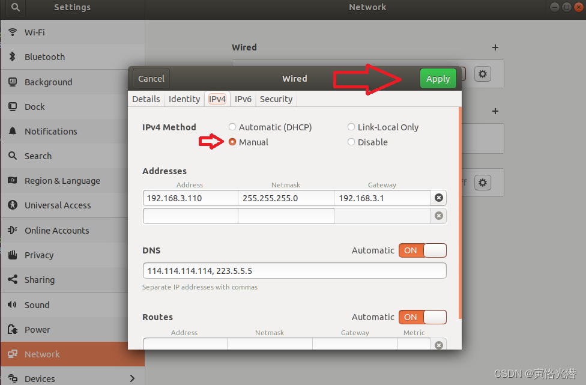
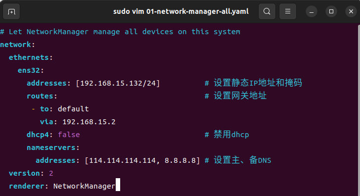

# 服务器相关

## 配置root用户密码
```bash
sudo passwd root
```

## 配置IP
### a.图形界面配置
打开网络设置(右上角的位置) ，点击“IPv4”，选择“Manual”（手动配置），分别输入IP地址Address、子网掩码Netmask、网关Gateway，以及DNS的可选，设置好了，点击右上角的 Apply（应用），如下图：



### b.配置文件
进入配置文件
```bash
cd /etc/netplan

sudo vim 01-network-manager-all.yaml
```
按照如下配置

